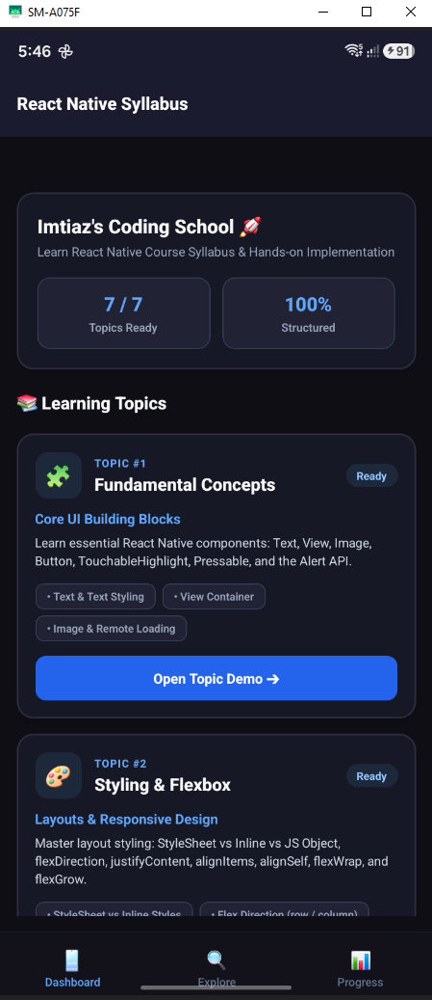
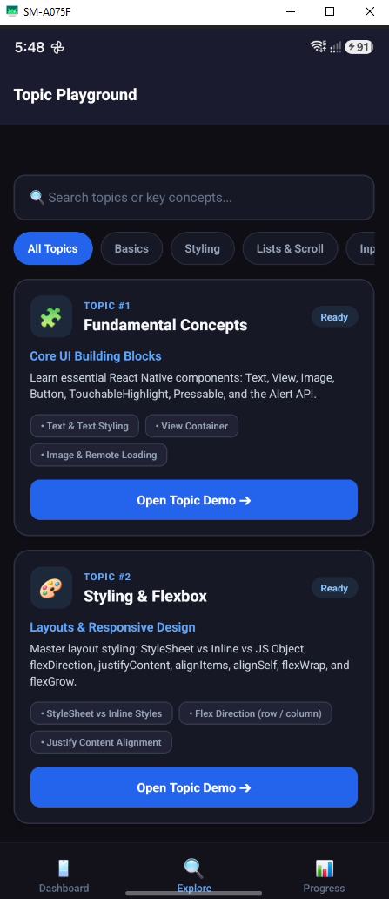
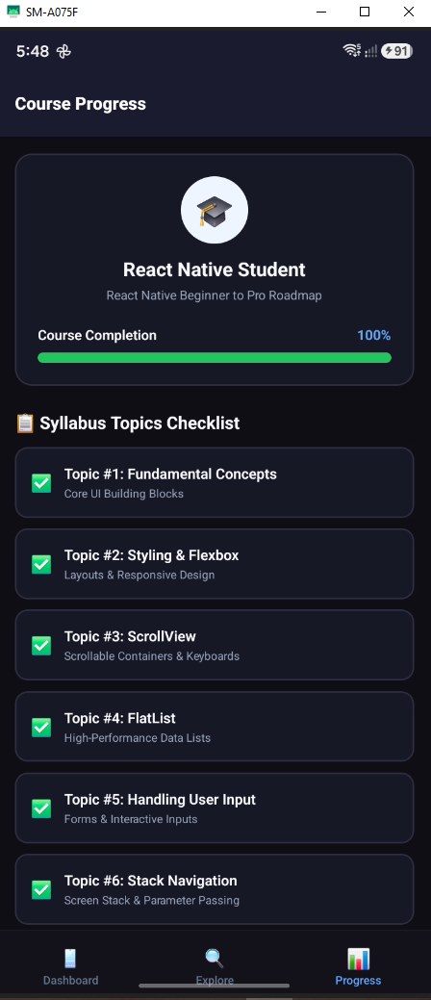
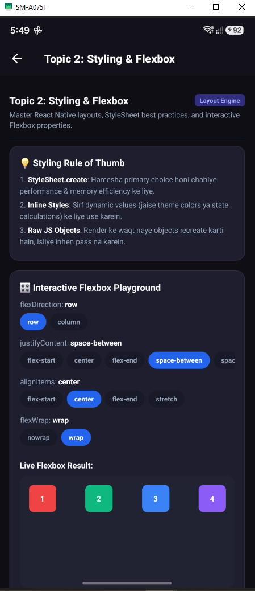

# 📱 React Native Learning App — Sheryians Coding School Roadmap

[](https://expo.dev)
[](https://reactnative.dev)
[](https://react.dev)
[](https://www.typescriptlang.org)
[](https://docs.expo.dev/router/introduction)

A complete, production-grade hands-on project implementing the full **React Native syllabus** taught at **Sheryians Coding School**. 

This application transforms core React Native concepts into an interactive, modular learning hub featuring real-time UI playgrounds, virtualized list grids, form management, dynamic Stack navigation, and multi-tab layouts.

---

## 🖼️ Application Previews

| **Dashboard Screen** | **Explore & Catalog** |
| :---: | :---: |
|  |  |

| **Progress & Checklist** | **Topic Detail & Stack Demo** |
| :---: | :---: |
|  |  |

---

## 📚 Complete Syllabus & Topic Coverage

| # | Topic | Key Concepts & Demos | Location |
| :-: | :--- | :--- | :--- |
| **1** | **Fundamental Concepts** | Text typography, View layout boxes, Remote Image loading, Button, TouchableHighlight, Pressable state handling, Alert API triggers. | [`src/app/topics/fundamentals.tsx`](./src/app/topics/fundamentals.tsx) |
| **2** | **Styling & Flexbox** | StyleSheet vs Inline rules, Interactive Flexbox Playground (`flexDirection`, `justifyContent`, `alignItems`, `flexWrap`, `flexGrow`). | [`src/app/topics/styling.tsx`](./src/app/topics/styling.tsx) |
| **3** | **ScrollView & Keyboards** | Vertical & Horizontal ScrollViews, `showsVerticalScrollIndicator` toggle, Safe Area insets, `Keyboard.dismiss` gesture handling. | [`src/app/topics/scrollview.tsx`](./src/app/topics/scrollview.tsx) |
| **4** | **FlatList & Grid Layouts** | Virtualized list rendering, `renderItem`, `keyExtractor`, interactive `numColumns` switcher (1, 2, 3 columns), `ItemSeparatorComponent`. | [`src/app/topics/flatlist.tsx`](./src/app/topics/flatlist.tsx) |
| **5** | **Handling User Input** | Single line & Multiline `TextInput`, state binding with `useState`, dynamic keyboard types (`email-address`, `numeric`, `phone-pad`), form submission. | [`src/app/topics/user-input.tsx`](./src/app/topics/user-input.tsx) |
| **6** | **Stack Navigation** | Expo Router Native Stack, screen pushing/popping, dynamic route parameters passing (`/details/[id]`), custom header styling. | [`src/app/topics/stack-navigation.tsx`](./src/app/topics/stack-navigation.tsx) |
| **7** | **Tab Navigation** | Expo Router `(tabs)` group layout, bottom tab bar configuration, tab icons, active tab indicators, and progress tracking. | [`src/app/(tabs)/_layout.tsx`](./src/app/(tabs)/_layout.tsx) |

---

## 🏗️ Project Directory Structure

```text
Learn-React-Native-from-Sheryians-Coding-School/
├── assets/
│   ├── images/                         # System icons & splash screen assets
│   └── projectPreview/                  # App preview screenshots
├── src/
│   ├── app/                            # Expo Router v57 File-Based Routes
│   │   ├── _layout.tsx                 # Root Stack Layout & Native Header Config
│   │   ├── index.tsx                   # Root Redirect to /(tabs)
│   │   ├── (tabs)/                     # Bottom Tab Navigation Group
│   │   │   ├── _layout.tsx             # Bottom Tab Bar styling & tab icons
│   │   │   ├── index.tsx               # Main Dashboard with Topic Cards Grid & Stats
│   │   │   ├── explore.tsx             # Topic Catalog with Search & Filter Chips
│   │   │   └── profile.tsx             # Syllabus Progress Checklist & Stats
│   │   ├── topics/                     # Individual Topic Interactive Demo Screens
│   │   │   ├── fundamentals.tsx        # Topic 1: Core Components
│   │   │   ├── styling.tsx             # Topic 2: Flexbox Playground
│   │   │   ├── scrollview.tsx          # Topic 3: ScrollView & Keyboards
│   │   │   ├── flatlist.tsx            # Topic 4: FlatList Grids
│   │   │   ├── user-input.tsx          # Topic 5: Form Inputs
│   │   │   └── stack-navigation.tsx    # Topic 6: Stack Router Push
│   │   └── details/
│   │       └── [id].tsx                # Topic 6 Demo: Dynamic Route Parameter Target
│   ├── components/
│   │   ├── TopicCard.tsx               # Reusable Interactive Card with router push
│   │   └── SectionHeader.tsx           # Standardized Title Header Component
│   ├── constants/
│   │   └── topics.ts                   # Topic metadata & course syllabus constants
│   └── types/
│       └── index.ts                    # Shared TypeScript interfaces & types
├── app.json                            # Expo app metadata & plugin configuration
├── babel.config.js                     # Babel preset configuration
├── package.json                        # Project dependencies & npm scripts
└── tsconfig.json                       # TypeScript configuration & path aliases (@/*)
```

---

## ⚡ Technical Best Practices & Architecture Highlights

1. **Expo Router v57 Conventions**: File-based routing using typed routes, `<Stack>`, `<Tabs>`, `useRouter()`, and `useLocalSearchParams()`.
2. **Strict `StyleSheet.create` Standard**: Clean separation of structural layout properties from dynamic theme color tokens.
3. **Type Safety**: Fully typed with TypeScript interfaces (`Topic`, `TopicCategory`, `TopicStatus`).
4. **Adaptive Dark / Light Themes**: Integrated with React Native `useColorScheme()` for automatic dark and light mode adaptation.
5. **Safe Area Integration**: Protected against device notches using `react-native-safe-area-context`.

---

## 🚀 Getting Started

### Prerequisites

* [Node.js](https://nodejs.org/) (v18 or higher)
* [Expo Go](https://expo.dev/go) app installed on your physical mobile device, or an iOS Simulator / Android Emulator.

### Installation

1. **Clone the repository**:
   ```bash
   git clone https://github.com/Imtiaz-Ali17314/Learn-React-Native-from-Sheryians-Coding-School.git
   cd Learn-React-Native-from-Sheryians-Coding-School
   ```

2. **Install dependencies**:
   ```bash
   npm install
   ```

3. **Start the development server**:
   ```bash
   npx expo start
   ```

> 💡 **Tip**: If you encounter Metro bundler cache issues after updating file routes, run:
> ```bash
> npx expo start -c
> ```

---

## 📜 License

This project is licensed under the [MIT License](LICENSE).
